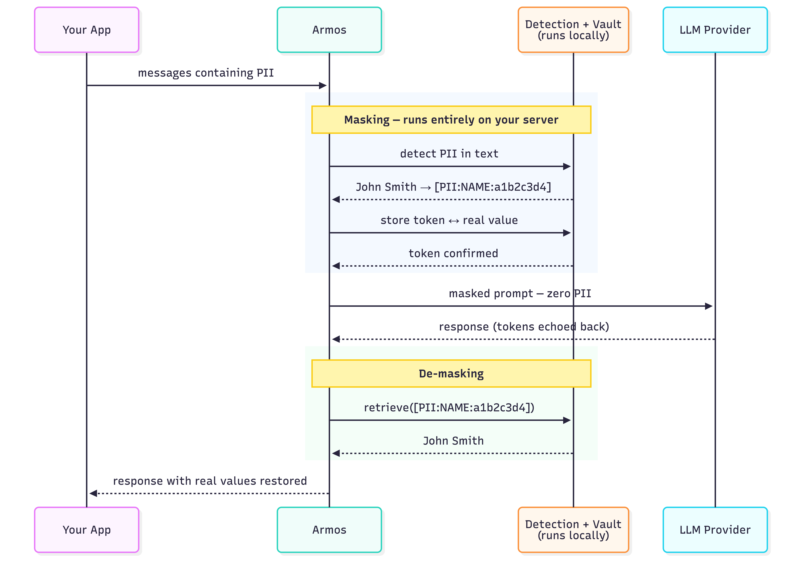

# Armos

**PII never reaches your LLM. One line of code.**

Armos wraps the OpenAI and Anthropic SDKs to automatically detect and mask personally identifiable information (PII) before it leaves your server — and restore the real values in the response. Your application code changes by exactly one word.

[](https://opensource.org/licenses/MIT)
[](https://www.python.org/downloads/)
[](https://pypi.org/project/armos/)
[](https://github.com/armos-ai/armos-python)

---

## The problem

Every time your application calls an LLM, it sends raw text to a third-party server. If a user's message contains their name, Aadhaar number, email, PAN card, or credit card — that data leaves your infrastructure.

This matters for:
- **Healthcare apps** — patient names, dates of birth, medical IDs
- **Fintech apps** — PAN, Aadhaar, bank details
- **Customer support tools** — names, emails, phone numbers, addresses
- **Any app** where users type free text that gets sent to OpenAI or Anthropic

Most teams know this is a risk. Few have time to build a proper masking layer before shipping. Armos is that layer, pre-built.

---

## How it works



**Detection runs entirely on your machine.** Presidio + spaCy analyse the text locally. No data is sent to any Armos server — there is no Armos server. The vault (token ↔ real value map) lives in your process memory, or optionally in your own Redis instance.

---

## Why Armos over alternatives?

**vs. building your own:** A custom masking layer takes weeks to build correctly 
and months to handle edge cases. Armos is a pip install.

**vs. LLM Guard:** LLM Guard focuses on prompt injection and toxicity — 
not PII masking. Different problem.

**vs. Presidio directly:** Presidio detects PII but doesn't handle 
tokenization, vault management, or SDK integration. Armos wraps all of that.

**Indian PII first-class:** Aadhaar and PAN detection built in. 
No competitor handles Indian identifiers reliably.

---

## Quickstart

### Install

```bash
pip install armos
```

For Redis-backed persistence across requests:
```bash
pip install armos[redis]
```

> **Note:** On first use, download the spaCy language model:
> ```bash
> python -m spacy download en_core_web_lg
> ```

### OpenAI

```python
# Before
from openai import OpenAI
client = OpenAI()

# After — one import added, one word changed
from openai import OpenAI
from armos import ArmosOpenAI

client = ArmosOpenAI(OpenAI())

# Everything else is identical
response = client.chat.completions.create(
    model="gpt-4o",
    messages=[{
        "role": "user",
        "content": "Summarise the case for patient John Smith, Aadhaar 2345 6789 0123"
    }]
)

# Real values are restored in the response automatically
print(response.choices[0].message.content)
```

### Anthropic

```python
from anthropic import Anthropic
from armos import ArmosAnthropic

client = ArmosAnthropic(Anthropic())

message = client.messages.create(
    model="claude-sonnet-4-6",
    max_tokens=1024,
    messages=[{
        "role": "user",
        "content": "Patient John Smith, DOB 12/04/1982, PAN ABCDE1234F"
    }]
)

print(message.content[0].text)  # real values restored
```

### With Redis (persistent vault across requests)

```python
# Token mappings survive across processes and requests
client = ArmosOpenAI(OpenAI(), store="redis://localhost:6379")
client = ArmosAnthropic(Anthropic(), store="redis://localhost:6379")

# Custom TTL (default: 24 hours)
client = ArmosOpenAI(OpenAI(), store="redis://localhost:6379", vault_ttl=3600)
```

### Standalone (any LLM or framework)

```python
from armos import Armos

guard = Armos()

result = guard.mask("Patient John Smith, Aadhaar 2345 6789 0123, email john@hospital.com")
print(result.text)
# → "Patient [PII:NAME:a1b2c3d4], Aadhaar [PII:AADHAAR:b2c3d4e5], email [PII:EMAIL:e5f6g7h8]"

print(result.has_pii)  # True

restored = guard.demask(result.text)
print(restored)
# → "Patient John Smith, Aadhaar 2345 6789 0123, email john@hospital.com"
```

---

## What gets detected

| Entity | Token | Example |
|--------|-------|---------|
| Person name | `[PII:NAME:…]` | John Smith |
| Email address | `[PII:EMAIL:…]` | john@hospital.com |
| Phone number | `[PII:PHONE:…]` | +91 98765 43210 |
| Aadhaar number | `[PII:AADHAAR:…]` | 2345 6789 0123 |
| PAN card | `[PII:PAN:…]` | ABCDE1234F |
| Credit / debit card | `[PII:CARD:…]` | 4111 1111 1111 1111 |
| IP address | `[PII:IP:…]` | 192.168.1.100 |
| API keys & secrets | `[PII:APIKEY:…]` | sk-abc123… / AKIA… / ghp_… |

---

## Token design

Tokens are **deterministic** and **normalisation-aware**:

```
"john smith"  →  [PII:NAME:a1b2c3d4]  ← stored: "john smith"
"John Smith"  →  [PII:NAME:a1b2c3d4]  ← same token, vault unchanged
"JOHN SMITH"  →  [PII:NAME:a1b2c3d4]  ← same token, vault unchanged
```

All casing variants of the same name map to one token. The LLM sees one consistent entity across a conversation — not three different people. De-masking restores the first-seen value.

---

## Vault options

| Option | Default | Use when |
|--------|---------|----------|
| In-memory | `Armos()` | Single request or single process |
| Redis | `Armos(store="redis://…")` | Multi-turn conversations, multiple workers, or across requests |

In-memory vault is zero configuration and the default. Redis vault persists token mappings so a token created in request 1 can be de-masked in request 5.

---

## v1 limitations

1. **Streaming not supported** — `stream=True` passes through without masking. (v1.1)
2. **Async clients not supported** — `AsyncOpenAI`, `AsyncAnthropic` pass through without masking. (v1.1)
3. **OpenAI Responses API not intercepted** — `client.responses.create()` passes through. (v1.1)
4. **Embeddings not masked** — `client.embeddings.create()` sends text as-is. (v1.1)
5. **Indian name accuracy** — `en_core_web_lg` is trained on English text; Indian names have lower recall than Western names. Fine-tuning planned for v2.
6. **Casing: first-seen wins** — De-masking always restores the first-seen casing of an entity. Use consistent casing in your prompts for exact restoration.
7. **Token length** — `[PII:NAME:a1b2c3d4]` is 18 chars vs `John` (4 chars). Near context-window limits this may push content over. Rare in practice.

---

## Contributing

Armos is open source and MIT licensed. Issues and pull requests welcome.

```bash
git clone https://github.com/armos-ai/armos-python
cd armos-python
pip install -e ".[dev,all]"
python -m spacy download en_core_web_lg
pytest tests/ -v
```

## License

MIT
